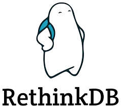

<h1 align="center" style="border-bottom: none;"> 👨🏾‍🎨 Mirror Drawing</h1>

[Based on](https://www.pluralsight.com/courses/react-socketio-rethinkdb-building-real-time-apps)


#### Using
React, Node, RethinkDB, RxJs
<p align="center">
    
    
</p>

#### How to use

##### Server
```bash
$ git clone https://github.com/PeterPimentel/mirror-drawing
$ cd mirror-drawing/
$ cd server
$ npm install
$ npm start
```

##### Client
```bash
$ cd mirror-drawing/
$ cd client
$ npm install
$ npm start
```

Remenber of install and prepare the database

This project have a lot of useful comments explaining how and why use some approaches.


----------------

😃 If you liked this project and used, please let me know!